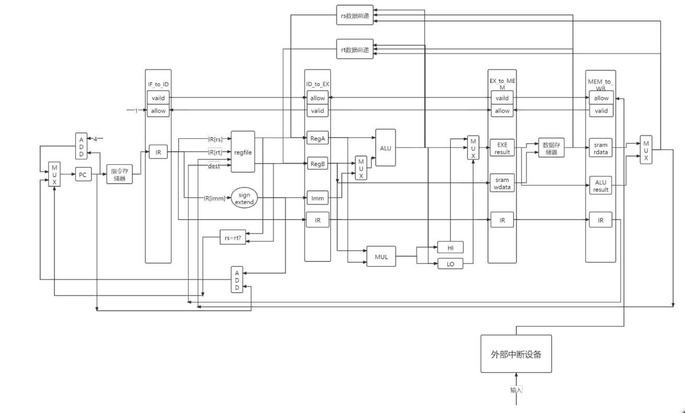

## 支持数据前递的经典五段流水线CPU
该CPU是按照《CPU设计实战》这本书的指导实现的，基于mips架构，目前支持的指令包括基本的运算指令，例如加减乘除，比较指令，与或非，跳转指令，load和store指令，详细可以看ID_stage中的代码。
数据通路图如下：  
  
下面列出实现的一些关键和要点，供参考：
#### 模块切分
流水线被切分为5段，分别是取指，译码，执行，访存和写回。每个部分单独写成一个模块，模块之间的数据传递通过BUS实现，BUS的一些定义可以见mycpu.h，其中列出了所有BUS的宽度。BUS一般是前面一级向后面一级的数据传递，但也存在向前传递，例如数据前递技术，以及BR_BUS，这个是用来实现在译码级就完成指令跳转的数据通路。
#### 同步RAM和异步RAM
CPU涉及到与RAM的交互，包括数据RAM和指令RAM（本CPU是指令数据RAM分离的）。RAM可以分为同步和异步两种，所谓异步，就是当前拍读，当前拍出结果，其行为类似于regfile。而同步就是说，使用时钟信号控制，当前拍边缘触发读，下一拍才能出结果。一般为了简单起见会用异步RAM。但是其性能远不如同步RAM。对于CPU来说，性能至关重要，使用异步RAM很容易造成性能瓶颈。所以本CPU支持同步RAM。  
涉及到与RAM交互的主要有两个部分，首先是取指级访问指令寄存器，然后是访存级访问数据寄存器。由于同步RAM当前拍读，下一拍出结果，对于取指级来说是不可接受的，因为在当前拍发出读信号，要等到下一拍才能够得到指令，但是下一拍就需要进行指令解析。要么就在取指级等待指令取出，但是这样速度将下降一倍。另外一种方法是，将IF级切分为两级，分别是pre-if和if，pre-if专门用来发出指令地址，而在if级则获取指令，从而传递给下一级。
#### 分支前移
分支指令涉及到两个操作数的比较，如果将比较放在ALU里面进行，那么分支指令最迟要在MEM级才能出结果，而此时已经顺序读取了若干条指令，这些指令一旦分支成功则需要全部作废。但是由于在ID级已经可以得到两个源操作数，所以可以在ID级产生比较结果并且通过BR_BUS控制pre-if产生的下一条指令地址。那么就可以将这种延迟抵消，相应的代价是关键路径变长。
#### 流水线互锁
对于五段流水线来说，如果其中有一级出现阻塞，那么上游任务就会被阻塞，要么可以采用控制器的方式对五段流水线进行统一管理，另一种更好的思路是互锁机制。以下图代码为例：
```verilog
assign ds_ready_go    = if_EXE_notloading;
assign ds_allowin     = !ds_valid || ds_ready_go && es_allowin;
assign ds_to_es_valid = ds_valid && ds_ready_go;
always @(posedge clk) begin
    if(reset)begin
        ds_valid<=1'b0;
    end
    else if(ds_allowin)begin
        ds_valid<=fs_to_ds_valid;
    end

    if (fs_to_ds_valid && ds_allowin) begin
        fs_to_ds_bus_r <= fs_to_ds_bus;
    end
end
```
上面是ID级的互锁机制，ds_valid表示当前级是否有有效数据，read_go表示当前级是否由于某种原因被阻塞，在这里有一种情况流水线需要阻塞，就是EXE级是load指令，因为load指令需要等到WB写回寄存器，所以在此之前读取这个寄存器是可能存在错误的。ds_allowin则表示当前级是否允许新数据进入，这包括两种情况，分别是当前级有有效数据但没有被阻塞，可以在下一拍传递下去，另一种就是当前级没有有效数据，所以允许进入。  
那么可以理解，当前级如果允许新的数据进入，那么上游既可能是有效数据也可能是无效的，所以取决于fs_to_ds_valid。而ds_to_es_valid则取决于当前级是否有有效数据，当前级是否可以下传递。  
流水线互锁起到的效果就是分布式地控制层级之间的流动关系，并且使用了非常简单的控制逻辑。
#### 数据前递
数据前递技术是极大减少指令流阻塞的关键。因为在普通情况下，寄存器在WB级被修改，但是需要在ID级读取。这就造成了写后读冲突，简单的方式是阻塞，更好的方式则是数据前递，比如一般计算结果在EXE已经出来，这时候就可以将数据前递到ID级的regfile读取的出口处，如果存在读取相关寄存器的情况，那么就直接采用新值而不是旧值。但由于load指令在exe级发出信号，在mem得到结果，所以需要针对exeload等待一个周期，这里用到了互锁机制。其余的情况通过bus直接前递即可。